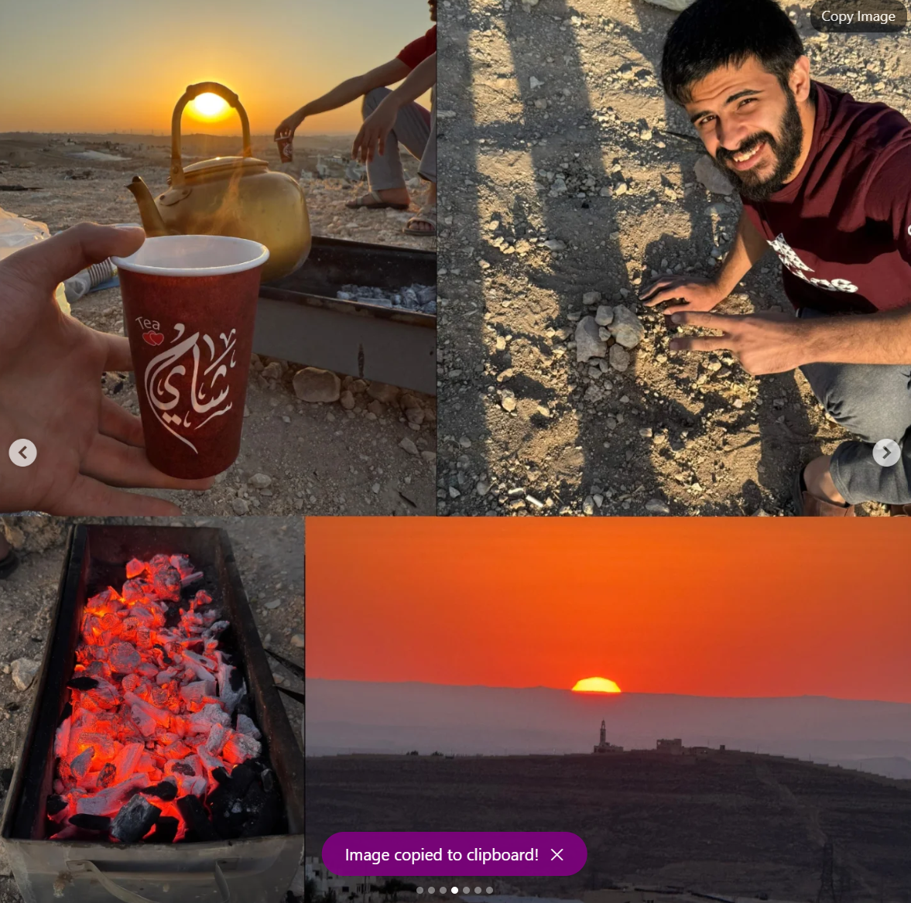

# Instagram Image Copy Button

A lightweight Chrome extension that adds a **Copy Image** button over Instagram post images, so you can copy a picture straight to your clipboard instead of screenshotting it.

<p align="center">
  <br>
  <em>Hover any Instagram post and a <strong>Copy Image</strong> button appears.</em>
</p>

## Features

- Adds a **Copy Image** button that appears on hover over Instagram post images.
- Copies the full-resolution image to your clipboard as a PNG (one click, no download).
- Shows a brief "Image copied to clipboard!" confirmation.
- Runs only on `instagram.com`. No tracking, no external servers, no data collection.

## Demo

<p align="center">
  <br>
  <em>Click it and the full-resolution image is copied, with a quick confirmation.</em>
</p>

<p align="center">
  <br>
  <em>Paste it anywhere — here, straight into Discord at full resolution.</em>
</p>

## Installation (load unpacked)

This extension is not on the Chrome Web Store, so install it manually:

1. Download this repository (green **Code** button → **Download ZIP**, then unzip) or clone it:
   ```
   git clone https://github.com/Moawiah188/instagram-image-copy-button.git
   ```
2. Open Chrome and go to `chrome://extensions`.
3. Turn on **Developer mode** (top-right toggle).
4. Click **Load unpacked** and select the extension folder.
5. Open [instagram.com](https://www.instagram.com), hover over any post image, and click **Copy Image**.

Works in Chrome and other Chromium browsers (Edge, Brave).

## How it works

A content script (`content.js`) watches for post images, overlays a button, and on click draws the image to a canvas and writes it to the clipboard via the async Clipboard API (`ClipboardItem`). Because it uses the clipboard, the browser needs the `clipboardWrite` permission.

## Permissions

| Permission | Why it's needed |
|---|---|
| `clipboardWrite` | To write the copied image to your clipboard. |
| `activeTab` | To run on the Instagram tab you're viewing. |

## Notes

- Instagram changes its page markup periodically. If the button stops appearing, the image container selector may need updating.

## License

Licensed under the [GNU General Public License v3.0](LICENSE).

## Author

Made by [Moawiah188](https://github.com/Moawiah188).
